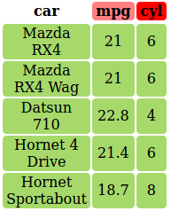
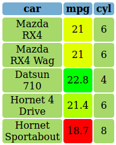
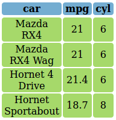

---
output:
  md_document:
    variant: markdown_github
---

<!-- README.md is generated from README.Rmd. Please edit that file -->

```{r, echo = FALSE}
knitr::opts_chunk$set(
  collapse = TRUE,
  comment = "#>",
  fig.path = "README-"
)
```

# colorTable

`colorTable` is a small library that acts as a wrapper around the `kabelExtra` package that allows the user to create colorful tables. 

Currently its mostly used to visualise data manipulation classes by me. The main function of the package is called `color_table` that takes a data.frame or matrix and different coloring options (see examples below).

Additionally, there are some small helper functions such as `view_html()` that renders html-code to the viewer and `color_gradient()` that takes a sequence of numbers and create corresponding color values between two input colors.

## Installation

Currently the package lives on GitHub, you can install it with 

```{r, eval=FALSE}
# install.packages("devtools")
devtools::install_github("DavZim/colorTable")
```


## Usage
```{r}
library(colorTable)

# use a small subset of the mtcars dataset
df <- data.frame(car = rownames(mtcars), mtcars, stringsAsFactors = F)
rownames(df) <- NULL
(df <- df[1:5, 1:3])

# define some colors for later
red   <- "#fc9272"
green <- "#a6d96a"
blue  <- "#74add1"
```
```{r, eval=F}
color_table(df)
```


### Specify Single Color
```{r, eval=F}
color_table(df, header_bg = red, body_bg = blue)
```


### Specify Multiple Colors
```{r}
# create a sequence of three colors from white to red
(header_bgs <- color_gradient(1:3, c("white", "red")))
```
```{r, eval=F}
color_table(df, header_bg = header_bgs)
```



### Specify Column Color
```{r, eval=F}
color_table(df, col_bgs = c(red, green, blue))
```


### Specify Row Color
```{r, eval=F}
color_table(df, header_bg = NULL, row_bgs = c(red, blue))
```


### Specify All Colors in a single Matrix
```{r}
# including the headers
color_mat <- matrix(c(
  "red", "green", "blue",
  color_gradient(1:3, c("red", "white")),
  color_gradient(1:3, c("blue", "white")),
  color_gradient(1:3, c("white", "red")),
  color_gradient(1:3, c("white", "blue")),
  color_gradient(1:3, c("red", "white"))
), ncol = 3, byrow = T)
color_mat
```
```{r, eval=F}
color_table(df, body_bg = color_mat)
```


## Example Case dplyr

Say we want to teach 'dplyr`'s data manipulation functions, we can visualize it with colorTable like so

```{r, include=FALSE}
library(dplyr)
```
```{r, eval=F}
library(dplyr)
```
```{r}
# create some colors
cols <- matrix(green, ncol = ncol(df), nrow = nrow(df))
cols
```


### Color MPG
```{r}
cols1 <- cols
cols1[, 2] <- color_gradient(df$mpg, c("red", "yellow", "green"))
```
```{r, eval=F}
color_table(df, cols1)
```


### Arrange by MPG
```{r}
# order the color-matrix by the order of mpg
cols1 <- cols1[order(df$mpg), ]
```
```{r, eval=F}
df %>% arrange(mpg) %>% color_table(cols1)
```


### Filter for cyl >= 6
```{r}
cols2 <- cols
cols2[, ] <- ifelse(df$cyl >= 6, green, red)
```
```{r, eval=F}
color_table(df, cols2)
```


```{r}
cols2 <- cols2[df$cyl >= 6, ]
```
```{r, eval=F}
df %>% filter(cyl >= 6) %>% color_table(cols2)
```



## Output Format

The format can be either HTML (`format = "html"`) or pdf (`format = "latex"`), if used inside of knitr, the format is determined automatically.

The internals are handled by [`kableExtra`](http://haozhu233.github.io/kableExtra) and the output should be kableExtra-compatible.

For example the last table rendered in latex looks like this:

```{r, eval=F}
# replicating the earier example:
df %>% arrange(mpg) %>% color_table(cols1, format = "latex")
```


