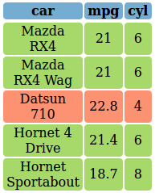

<!-- README.md is generated from README.Rmd. Please edit that file -->
colorTable
==========

`colorTable` is a small library that acts as a wrapper around the `kabelExtra` package that allows the user to create colorful tables.

Currently its mostly used to visualise data manipulation classes by me. The main function of the package is called `color_table` that takes a data.frame or matrix and different coloring options (see examples below).

Additionally, there are some small helper functions such as `view_html()` that renders html-code to the viewer and `color_gradient()` that takes a sequence of numbers and create corresponding color values between two input colors.

Installation
------------

Currently the package lives on GitHub, you can install it with

``` r
# install.packages("devtools")
devtools::install_github("DavZim/colorTable")
```

Usage
-----

``` r
library(colorTable)

# use a small subset of the mtcars dataset
df <- data.frame(car = rownames(mtcars), mtcars, stringsAsFactors = F)
rownames(df) <- NULL
(df <- df[1:5, 1:3])
#>                 car  mpg cyl
#> 1         Mazda RX4 21.0   6
#> 2     Mazda RX4 Wag 21.0   6
#> 3        Datsun 710 22.8   4
#> 4    Hornet 4 Drive 21.4   6
#> 5 Hornet Sportabout 18.7   8

# define some colors for later
red   <- "#fc9272"
green <- "#a6d96a"
blue  <- "#74add1"
```

``` r
color_table(df)
```


### Specify Single Color

``` r
color_table(df, header_bg = red, body_bg = blue)
```


### Specify Multiple Colors

``` r
# create a sequence of three colors from white to red
(header_bgs <- color_gradient(1:3, c("white", "red")))
#> [1] "#FFFFFF" "#FF8080" "#FF0000"
```

``` r
color_table(df, header_bg = header_bgs)
```


### Specify Column Color

``` r
color_table(df, col_bgs = c(red, green, blue))
```


### Specify Row Color

``` r
color_table(df, header_bg = NULL, row_bgs = c(red, blue))
```


### Specify All Colors in a single Matrix

``` r
# including the headers
color_mat <- matrix(c(
  "red", "green", "blue",
  color_gradient(1:3, c("red", "white")),
  color_gradient(1:3, c("blue", "white")),
  color_gradient(1:3, c("white", "red")),
  color_gradient(1:3, c("white", "blue")),
  color_gradient(1:3, c("red", "white"))
), ncol = 3, byrow = T)
color_mat
#>      [,1]      [,2]      [,3]     
#> [1,] "red"     "green"   "blue"   
#> [2,] "#FF0000" "#FF7E7E" "#FFFFFF"
#> [3,] "#0000FF" "#7E7EFF" "#FFFFFF"
#> [4,] "#FFFFFF" "#FF8080" "#FF0000"
#> [5,] "#FFFFFF" "#8080FF" "#0000FF"
#> [6,] "#FF0000" "#FF7E7E" "#FFFFFF"
```

``` r
color_table(df, body_bg = color_mat)
```


Example Case dplyr
------------------

Say we want to teach 'dplyr\`'s data manipulation functions, we can visualize it with colorTable like so

``` r
library(dplyr)
```

``` r
# create some colors
cols <- matrix(green, ncol = ncol(df), nrow = nrow(df))
cols
#>      [,1]      [,2]      [,3]     
#> [1,] "#a6d96a" "#a6d96a" "#a6d96a"
#> [2,] "#a6d96a" "#a6d96a" "#a6d96a"
#> [3,] "#a6d96a" "#a6d96a" "#a6d96a"
#> [4,] "#a6d96a" "#a6d96a" "#a6d96a"
#> [5,] "#a6d96a" "#a6d96a" "#a6d96a"
```

### Color MPG

``` r
cols1 <- cols
cols1[, 2] <- color_gradient(df$mpg, c("red", "yellow", "green"))
```

``` r
color_table(df, cols1)
```


### Arrange by MPG

``` r
# order the color-matrix by the order of mpg
cols1 <- cols1[order(df$mpg), ]
```

``` r
df %>% arrange(mpg) %>% color_table(cols1)
```


### Filter for cyl &gt;= 6

``` r
cols2 <- cols
cols2[, ] <- ifelse(df$cyl >= 6, green, red)
```

``` r
color_table(df, cols2)
```



``` r
cols2 <- cols2[df$cyl >= 6, ]
```

``` r
df %>% filter(cyl >= 6) %>% color_table(cols2)
```


Output Format
-------------

The format can be either HTML (`format = "html"`) or pdf (`format = "latex"`), if used inside of knitr, the format is determined automatically.

The internals are handled by [`kableExtra`](http://haozhu233.github.io/kableExtra) and the output should be kableExtra-compatible.

For example the last table rendered in latex looks like this:

``` r
# replicating the earier example:
df %>% arrange(mpg) %>% color_table(cols1, format = "latex")
```


